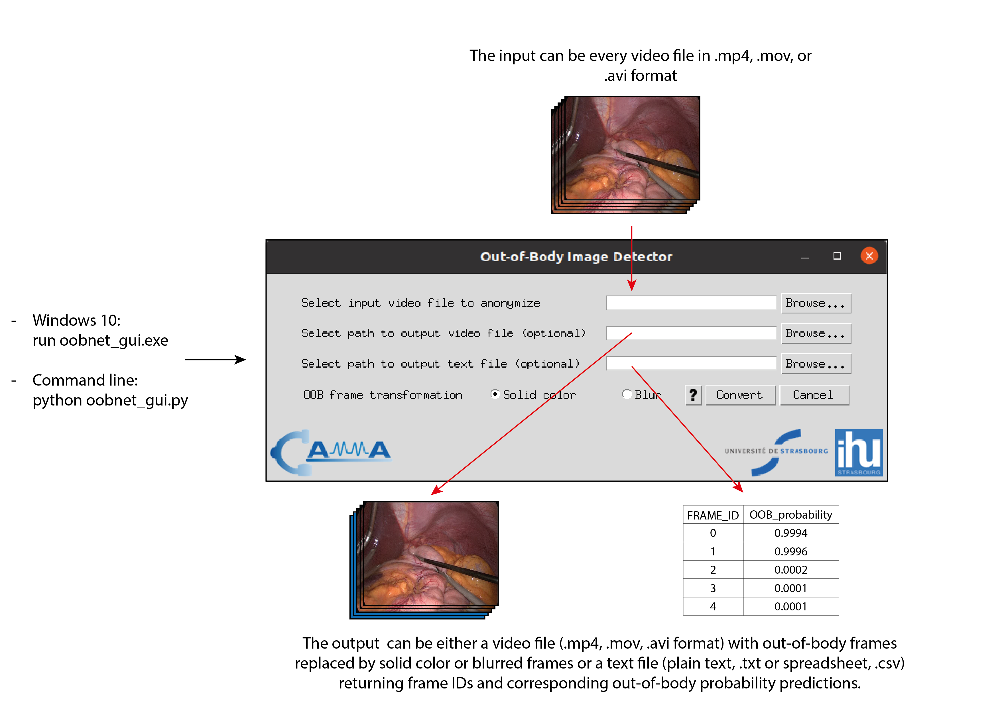

<div align="center">
<a href="http://camma.u-strasbg.fr/">

</a>
</div>

# Out-of-body image detection in surgical videos

***Research Group CAMMA / University of Strasbourg / IHU Strasbourg***

http://camma.u-strasbg.fr/

Out-of-body frames in endoscopic surgeries can contain privacy sensitive information. This tool is meant to help protect privacy by detecting and blurring out these out-of-body frames. The performance of this tool is reported in the publication mentioned below. The authors or their institutions can not be held liable for any privacy concern due to undetected out-of-body frames. This tool can be used through either the command-line interface or the GUI application. If you're using Windows 10, you can download and run the executable directly, from [here].

<center></center>

# Usage
## From command-line
Execute the OOBNet by passing the input and output video paths in the command-line

```python oobnet_exec.py --video_in <input/video/path> --video_out <output/video/path>```

Optionally, you can also save the results to a text file. The file will contain frame ids and raw prediction results.

```python oobnet_exec.py --video_in <input/video/path> --video_out <output/video/path> --text_out <output/text/path>```

## GUI
Alternatively, you can launch the GUI application by running the following command:

```python oobnet_gui.py```

# Installation

1. Install Anaconda on your computer if you don't already have it. You can download it from [here](https://www.anaconda.com/).

2. Clone this repository then ```cd``` to its directory on your computer. Download the model checkpoint

```wget -P ckpt https://s3.unistra.fr/camma_public/github/oobnet_detection/ckpt/oobnet_weights.h5```

3. Create a new conda environment
```conda create --name oob_detection python==3.8.5```

4. Activate the environment
```conda activate oob_detection```

5. Install dependencies
```pip3 install -r requirements.txt```

Note: If you have a GPU, you can replace *tensorflow* with *tensorflow-gpu* in the requirements.txt file before the 5th step.

# Credits
When referring to this software, please cite the following publication:

**cite our paper**

# License
This code is available for non-commercial scientific research purposes as defined in the [CC BY-NC-SA 4.0](https://creativecommons.org/licenses/by-nc-sa/4.0/). By downloading and using this code you agree to the terms in the [LICENSE](LICENSE). Third-party codes are subject to their respective licenses.

This license allows reusers to distribute, remix, adapt, and build upon the material in any medium or format for noncommercial purposes only, and only so long as attribution is given to the creator. If you remix, adapt or build upon the material, you must license the modified material under identical terms.
